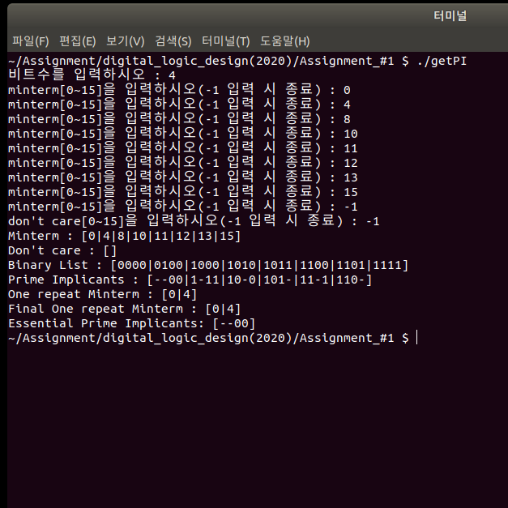

# 논리회로설계 PI/EPI 찾기

------

## 실행 방법 설명

​	1) 소스 파일을 컴파일 한 뒤 실행합니다.

​	2) 비트 수를 입력합니다.

> 0 이하의 수는 받지 않습니다.

​	3) minterm을 입력합니다.

> -1을 입력 시 입력이 종료되며, 음수나 반복된 수는 받지 않습니다.

​	4) don't care를 입력합니다.

> -1을 입력 시 입력이 종료되며, 음수나 반복된 수는 받지 않습니다. minterm에 포함된 수도 받지 않습니다.

​	5) 결과가 출력됩니다.

> Minterm : 입력한 minterm을 출력합니다.
>
> Don't care : 입력한 don't care을 출력합니다.
>
> Binary List : minterm과 don't care의 비트 수에 따른 이진 데이터를 출력합니다.
>
> Prime Implicats : PI를 출력합니다.
>
> One repeat Minterm : minterm과 don't care중에서 한번만 나오는 요소들을 출력합니다.
>
> Final One repeat Minterm : don't care을 제외한 한번만 나오는 minterm들을 출력합니다.
>
> Essential Prime Implicants : EPI를 출력합니다.

​	6) 예시

>    

------

## Source Code 설명

> ```c++
> #include <iostream>
> #include <math.h>
> #include <vector>
> #include <string.h>
> #include <algorithm>
> 
> using namespace std;
> ```

​			> 2진수의 형태를 10진수로 바꾸는 함수

> ```c++
>vector<string> binaryToNum(vector<string> v)
> {
>  vector<string> result;
>  for (int i = 0; i < v.size(); i++)
>     {
>         int num = 0;
>         for (int j = 0; j < v[i].length(); j++)
>         {
>             if (v[i][j] == '1')
>             {
>                 num += (int)pow(2, v[i].size() - j - 1);
>             }
>         }
>         result.push_back(to_string(num));
>     }
>     return result;
>    }
>    ```

​			> PI가 표현할 수 있는 minterm들을 담는 vector 리턴

> ```c++
>vector<string> getPossibleElements(string s)
> {
>  int count = 0;
>  int len = s.length();
>     vector<string> possible;
>    
>     for (int i = 0; i < len; i++)
>  {
>         if (s[i] == '-')
>         {
>             count++;
>         }
>     }
>    
>     if (count == 0)
>  {
>         possible.push_back(s);
>     }
>    
>     if (count >= 1)
>  {
>         string a0 = s;
>         string a1 = s;
>         for (int i = 0; i < len; i++)
>         {
>             if (s[i] == '-')
>             {
>                 a0[i] = '1';
>                 a1[i] = '0';
>                 count--;
>                 break;
>             }
>         }
>         if (count == 0)
>         {
>             possible.push_back(a0);
>             possible.push_back(a1);
>         }
>         else
>         {
>             possible = getPossibleElements(a0);
>             vector<string> temp = getPossibleElements(a1);
>             possible.insert(possible.end(), temp.begin(), temp.end());
>         }
>     }
>    
>     return possible;
> }
>    ```

​			> getPossibleElements 메서드로 나오는 vector들을 결합

> ```c++
>vector<string> getPossible(vector<string> v)
> {
>  vector<string> result;
>  int len = v.size();
>     for (int i = 0; i < len; i++)
>     {
>         vector<string> temp = getPossibleElements(v[i]);
>         result.insert(result.end(), temp.begin(), temp.end());
>     }
>     return result;
>    }
>    ```

​			> 두 vector가 같은지 판단 (phaseUP 메서드 동작 판단)

> ```c++
>bool isEqual(vector<string> v1, vector<string> v2)
> {
>  sort(v1.begin(), v1.end());
>  sort(v2.begin(), v2.end());
>    
>     if (v1.size() != v2.size())
>  {
>         return false;
>     }
>     for (int i = 0; i < v1.size(); i++)
>     {
>         if (v1[i] != v2[i])
>         {
>             return false;
>         }
>     }
>     return true;
>    }
>    ```

​			> string이 vertor에 있는지 확인

> ```c++
>bool checkInVectorString(vector<string> v, string s)
> {
>  for (int i = 0; i < v.size(); i++)
>  {
>         if (v[i].compare(s) == 0)
>         {
>             return true;
>         }
>     }
>     return false;
>    }
>    ```

​			> int가 vector에 있는지 확인

> ```c++
>bool checkInVectorInt(vector<int> v, int n)
> {
>  for (int i = 0; i < v.size(); i++)
>  {
>         if (v[i] == n)
>         {
>             return true;
>         }
>     }
>     return false;
>    }
>    ```

​			> 0001 , 0011 -> 00-1 처럼 변환하는 함수

> ```c++
>string getCompareBinary(string s1, string s2)
> {
>  int length = s1.length();
>  for (int i = 0; i < length; i++)
>     {
>         if (s1[i] != s2[i])
>         {
>             s1[i] = '-';
>         }
>     }
>     return s1;
>    }
>    ```

​			> 0001, 0011 가 한끗 차이 나느냐 판단

> ```c++
>bool isCompareBinary(string s1, string s2)
> {
>  int count = 0;
>  int length = s1.length();
>     for (int i = 0; i < length; i++)
>     {
>         if (s1[i] != s2[i])
>         {
>             count++;
>             s1[i] = '-';
>         }
>     }
>     if (count == 1)
>     {
>         return true;
>     }
>     else
>     {
>         return false;
>     }
>    }
>    ```

​			> 10진수를 2진수로 전환하는 함수

> ```c++
>string getBinary(int n, int b_n)
> {
>  int resultInt = 0;
>  for (int i = 1; n > 0; i *= 10)
>     {
>         int binary = n % 2;
>         resultInt += binary * i;
>         n /= 2;
>     }
>     string s = to_string(resultInt);
>     string result(b_n, '0');
>     result.replace(b_n - s.length(), s.length(), s);
>     return result;
>    }
>    ```

​			> int형 vector을 string형 vector로 바꿈

> ```c++
>vector<string> getBinaryList(vector<int> v, int b_n)
> {
>  vector<string> result;
>  for (int i = 0; i < v.size(); i++)
>     {
>         result.push_back(getBinary(v[i], b_n));
>     }
>    
>     return result;
> }
>    ```

​			> 한끗 차이 나는 것끼리 묶어 다음 단계로 이동, 포함 안된 것들도 같이 포함

> ```c++
>vector<string> phaseUp(vector<string> binaryList)
> {
>  vector<string> newBinaryList;
>  vector<int> check;
>     check.assign(binaryList.size(), 0);
>    
>     for (int j = 0; j < binaryList.size(); j++)
>  {
>         for (int k = j; k < binaryList.size(); k++)
>         {
>             if (isCompareBinary(binaryList[j], binaryList[k]))
>             {
>                 check[j] = 1;
>                 check[k] = 1;
>                 if (!checkInVectorString(newBinaryList, getCompareBinary(binaryList[j], binaryList[k])))
>                 {
>                     newBinaryList.push_back(getCompareBinary(binaryList[j], binaryList[k]));
>                 }
>             }
>         }
>     }
>    
>     for (int i = 0; i < binaryList.size(); i++)
>  {
>         if (check[i] != 1 and !checkInVectorString(newBinaryList, binaryList[i]))
>         {
>             newBinaryList.push_back(binaryList[i]);
>         }
>     }
>    
>     return newBinaryList;
> }
>    ```

​			> vertor내 요소들 출력

> ```c++
>void printList(vector<auto> v)
> {
>  if (v.size() == 0)
>  {
>         cout << "]" << endl;
>     }
>    
>     for (int i = 0; i < v.size(); i++)
>  {
>         if (i == v.size() - 1)
>         {
>             cout << v[i] << "]" << endl;
>         }
>         else
>         {
>             cout << v[i] << "|";
>         }
>     }
>    }
>    ```

​			> 해당 인수의 빈도수 반환

> ```c++
>int getFrequencyOf(vector<string> v, string s)
> {
>  int count = 0;
>  for (int i = 0; i < v.size(); i++)
>     {
>         if (s == v[i])
>         {
>             count++;
>         }
>     }
>     return count;
>    }
>    ```

​			> EPI에 해당하는 minterm이 담긴 vector 반환

> ```c++
>vector<string> getOneRepeatNum(vector<string> binaryToNum)
> {
>  vector<string> result;
>  int len = binaryToNum.size();
>     int count = 0;
>     for (int i = 0; i < binaryToNum.size(); i++)
>     {
>         string s = binaryToNum[i];
>         count = getFrequencyOf(binaryToNum, s);
>         if (count == 1)
>         {
>             result.push_back(s);
>         }
>     }
>     return result;
>    }
>    ```

​			> 해당 원소의 index 반환

> ```c++
>int getIndexOf(vector<string> v, string s)
> {
>  int index = -1;
>  for (int i = 0; i < v.size(); i++)
>     {
>         if (v[i] == s)
>         {
>             index = i;
>         }
>     }
>     return index;
>    }
>    ```

​			> EPI에 해당하는 minterm에서 don't care minterm을 뺌

> ```c++
>vector<string> minusDontCare(vector<string> oneRepeat, vector<int> dontCare)
> {
>  vector<string> result = oneRepeat;
>  int idx;
>     for (int i = 0; i < dontCare.size(); i++)
>     {
>         string s = to_string(dontCare[i]);
>         if (checkInVectorString(result, s))
>         {
>             idx = getIndexOf(result, s);
>             result.erase(result.begin() + idx);
>         }
>     }
>     return result;
>    }
>    ```

​			\> PI가 EPI인지 확인
​			(PI가 나타낼 수 있는 minterm중에 final one repeat minterm에 포함되는 것이 있으면 해당 PI는 EPI임)

> ```c++
>vector<string> isEpi(vector<string> piList, vector<string> finalList)
> {
>  vector<string> result;
>  bool found = false;
>     vector<string> temp;
>     for (int i = 0; i < piList.size(); i++)
>     {
>         temp = getPossibleElements(piList[i]);
>         temp = binaryToNum(temp);
>         for (int j = 0; j < finalList.size(); j++)
>         {
>             if (checkInVectorString(temp, finalList[j]))
>             {
>                 found = true;
>             }
>             if (found)
>             {
>                 result.push_back(piList[i]);
>                 found = false;
>             }
>         }
>     }
>     return result;
>    }
>    ```

​			> EPI가 반복으로 나오면 반복으로 나오는 것을 중지

> ```c++
>vector<string> removeRepeat(vector<string> epiList)
> {
>  vector<string> result;
>  for (int i = 0; i < epiList.size(); i++)
>     {
>         if (!checkInVectorString(result, epiList[i]))
>         {
>             result.push_back(epiList[i]);
>         }
>     }
>     return result;
>    }
>    ```

​			> minterm을 input 받는 함수

> ```c++
> vector<int> inputMinterm(int maxNum)
> {
> vector<int> mintermList;
> int indexOfMinterm = 0;
>  while (indexOfMinterm != maxNum)
>  {
>      int mintermNum;
>         cout << "minterm[0~" << maxNum - 1 << "]을 입력하시오(-1 입력 시 종료) : ";
>         cin >> mintermNum;
>         if (!cin)
>         {
>             cout << "숫자를 입력해주세요." << endl;
>             cin.clear();
>             cin.ignore();
>             continue;
>         }
>      if (mintermNum >= maxNum)
>      {
>          cout << "주어진 비트수보다 높은 minterm을 입력하셨습니다. 다시 입력해주세요." << endl;
>          continue;
>      }
> 
>      if (mintermNum < -1)
>   {
>          cout << "음수를 입력하셨습니다. 다시 입력해주세요." << endl;
>          continue;
>      }
> 
>      if (mintermNum == -1)
>   {
>          break;
>      }
> 
>      if (indexOfMinterm == 0)
>   {
>          mintermList.push_back(mintermNum);
>          indexOfMinterm++;
>          continue;
>      }
> 
>      if (!checkInVectorInt(mintermList, mintermNum))
>   {
>          indexOfMinterm++;
>          mintermList.push_back(mintermNum);
>      }
>      else
>      {
>          cout << "같은 수를 입력하셨습니다. 다시 입력해주세요." << endl;
>          continue;
>      }
>  }
>  return mintermList;
> }
> ```

​			> don't care을 input 받는 함수

> ```c++
> vector<int> inputDontCare(int maxNum, vector<int> mintermList)
> {
> vector<int> dontcareList;
> int indexOfDontcare = 0;
>  int indexOfMinterm = mintermList.size();
>  while (indexOfDontcare != maxNum - indexOfMinterm)
>  {
>      int dontCareNum;
>         cout << "don't care[0~" << maxNum - 1 << "]을 입력하시오(-1 입력 시 종료) : ";
>         cin >> dontCareNum;
>      if (!cin)
>         {
>             cout << "숫자를 입력해주세요." << endl;
>             cin.clear();
>             cin.ignore();
>             continue;
>         }
>      if (dontCareNum >= maxNum)
>      {
>          cout << "주어진 비트수보다 높은 don't care을 입력하셨습니다. 다시 입력해주세요." << endl;
>          continue;
>      }
> 
>      if (dontCareNum < -1)
>   {
>          cout << "음수를 입력하셨습니다. 다시 입력해주세요." << endl;
>          continue;
>      }
> 
>      if (dontCareNum == -1)
>   {
>          break;
>      }
> 
>      bool exitOuterLoop = false;
> 
>      for (int i = 0; i < mintermList.size(); i++)
>   {
>          if (dontCareNum == mintermList[i])
>          {
>              cout << "minterm과 중복되었습니다. 다시 입력해주세요." << endl;
>              exitOuterLoop = true;
>              break;
>          }
>      }
> 
>      if (exitOuterLoop == true)
>   {
>          continue;
>      }
> 
>      if (indexOfDontcare == 0)
>   {
>          dontcareList.push_back(dontCareNum);
>          indexOfDontcare++;
>          continue;
>      }
> 
>      if (!checkInVectorInt(dontcareList, dontCareNum))
>   {
>          indexOfDontcare++;
>          dontcareList.push_back(dontCareNum);
>      }
>      else
>      {
>          cout << "같은 수를 입력하셨습니다. 다시 입력해주세요." << endl;
>          continue;
>      }
>  }
>  return dontcareList;
> }
> ```

​			> main() 문

> ```c++
> int main()
> {
> int input = 0;
>     while (input <= 0)
>     {
>         cout << "비트수를 입력하시오 : ";
>         cin >> input;
>         if (!cin)
>         {
>             cout << "숫자를 입력해주세요." << endl;
>             cin.clear();
>             cin.ignore();
>             continue;
>         }
>         if (input <= 0)
>         {
>             cout << "0 이하의 수를 입력하셨습니다. 다시 입력해주세요." << endl;
>         }
>     }
> 
>  int mintermNum;
> int dontCareNum;
>  int maxNum = (int)pow(2, input);
> 
>  vector<int> mintermList;
> vector<int> dontcareList;
> 
>  vector<int> numList;            // input의 10진수를 포함
> vector<string> binaryList;      // input의 2진수를 포함
>  vector<string> piList;          // prime implicants를 가지고 있는 벡터
>  vector<string> binaryToNumList; // pi에서 epi를 찾아내기 위해 중간과정의 역할을 하는 벡터
>  vector<string> epiList;         // epi를 가지고 있는 벡터
> 
>  mintermList = inputMinterm(maxNum);
> sort(mintermList.begin(), mintermList.end());
> 
>  dontcareList = inputDontCare(maxNum, mintermList);
> sort(dontcareList.begin(), dontcareList.end());
> 
>  cout << "Minterm : [";
> printList(mintermList);
> 
>  cout << "Don't care : [";
> printList(dontcareList);
> 
>  mintermList.insert(mintermList.end(), dontcareList.begin(), dontcareList.end()); // minterm input과 dont care input을 합침
> numList = mintermList;
> 
>  binaryList = getBinaryList(numList, input); // input 원소들을 2진수 형태로 변환
> sort(binaryList.begin(), binaryList.end());
> 
>  cout << "Binary List : [";
> printList(binaryList);
> 
>  piList = binaryList;
> do
>  {
>      piList = phaseUp(piList);
>      sort(piList.begin(), piList.end());
>  } while (!isEqual(piList, phaseUp(piList))); // minterm의 한끗차이끼리 그룹핑 -> prime implicants 구함
> 
>  cout << "Prime Implicants : [";
> printList(piList);
> 
>  binaryToNumList = getPossible(piList); // prime implicants가 가질 수 있는 minterm 수를 모두 받음
> 
>  binaryToNumList = binaryToNum(binaryToNumList); // 2진수를 10진수 형태로 변환
> sort(binaryToNumList.begin(), binaryToNumList.end());
> 
> binaryToNumList = getOneRepeatNum(binaryToNumList); // prime implicants가 가질 수 있는 모든 minterm들 중 오로지 한번만 나오는 minterm을 가져옴
> 
>  cout << "One repeat Minterm : [";
> printList(binaryToNumList); // prime implicants가 가질 수 있는 모든 minterm들 중 오로지 한번만 나오는 minterm 출력
> 
> binaryToNumList = minusDontCare(binaryToNumList, dontcareList); // 그 minterm들 중 don't care의 minterm은 제거 
> 
> cout << "Final One repeat Minterm : [";
> printList(binaryToNumList); // 최종적으로 EPI에 해당하는 minterm 출력
> 
> epiList = isEpi(piList, binaryToNumList); // EPI에 해당하는 minterm을 가지고 있는 PI를 vector로 받아옴 (즉 EPI를 구함)
> epiList = removeRepeat(epiList);          // EPI가 반복적으로 나오는거 제거
> 
>  cout << "Essential Prime Implicants: [";
> printList(epiList);
> }
> ```
>

------

## 제출물


- Code설명.md
- Code설명.pdf
- getPI (실행 파일)
- getPI.cpp (소스 코드)
- screenshot.png (결과 출력 스크린샷)

------

@ 제출자 / 20171620 문성찬